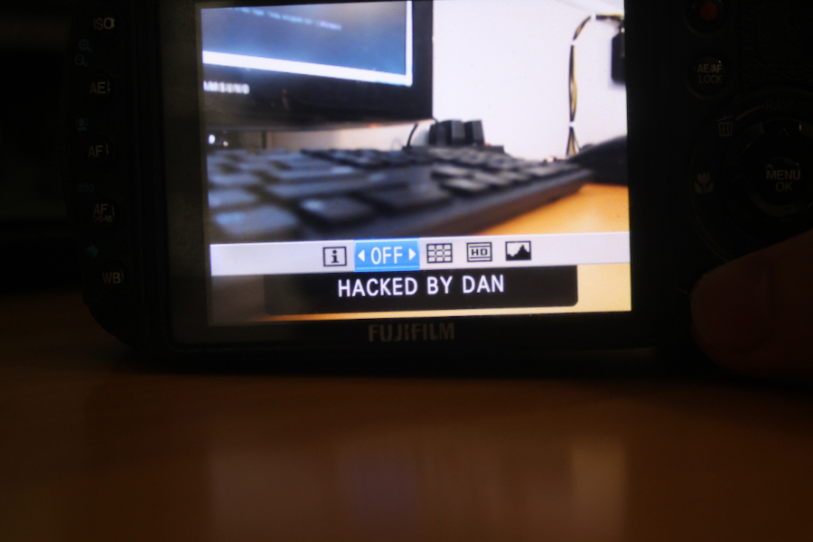

	

		

			

				

					<h3 class="card-title">What is FujiHack?</h3>
					

						FujiHack is a <i>research project</i> that is attempting to reverse engineer the FujiFilm digital cameras.
						<ul>
							<li>FujiHack is a software/hack that can be run on Fujifilm X/GFX/HS/F/Z/Pro cameras.</li>
							<li>The project goal is to gain <a href="https://en.wikipedia.org/wiki/Reverse_engineering#Legality">interoperability</a> on Fujifilm cameras.</li>
							<li><b>It is currently a research project and unfortunately doesn't have any useful photography features.</b></li>
							<li>FujiHack currently offers an online tool that patches the firmware of X/GFX/HS/F/Z/Pro cameras, and allows
							<b>quick code execution over PTP/USB</b>.</li>
						</ul>
					

				

			

		

		

			
		

	

	<h2 class="text-center">Latest Updates</h2>
	

		

			<a href="https://github.com/fujihack/fujihack/releases/tag/0.1.0">
			
			<h3>FujiHack Debugger Released</h3>
			</a>
		

		

			<a href="https://www.youtube.com/watch?v=u0qltt3mDio">
			
			<h3>Gyroscope Tetris</h3>
			</a>
		

		

			<a href="https://www.youtube.com/watch?v=E62S_GleN6M">
			
			<h3>Menu Demo</h3>
			</a>
		

	

## Will it work with my camera?
FujiHack will only work on a very specific RTOS and firmware type. You can put your firmware file into the [web patcher](https://fujihack.github.io/patcher/) to see if FujiHack supports your firmware type.
In general, **FujiHack does NOT support the XP and S series Fujifilm cameras**. The S Series has already been [hacked by CHDK forum members](https://chdk.setepontos.com/index.php?topic=6484.0).

## When will you add this feature?
Being an non-commercial open source project, FujiHack is not a company and has no deadlines or plans. Being a hobby project,
FujiHack is only developed on when the hackers feel like fooling around with it.

## Is it legal?
As the project's goal is to achieve *interoperability*, Fujihack is perfectly legal as per the [Digital Millennium Copyright Act](https://www.law.cornell.edu/uscode/text/17/1201).
To avoid any further legal issues, FujiHack non-commercial, at least for now.

## What is it written in?
The firmware debugger injection patch that allows PTP/USB code execution is written in Arm 32 Bit Assembly. Most Fujifilm cameras are Arm v5.
The code that is loaded onto the camera through PTP/USB is written in C and Rust.

---

FujiHack is licensed under the GNU General Public License v3.0. This project is not affiliated with or endorsed by Fujifilm or any other group.  
The source code is open source and hosted on [Github](https://github.com/fujihack/fujihack).
